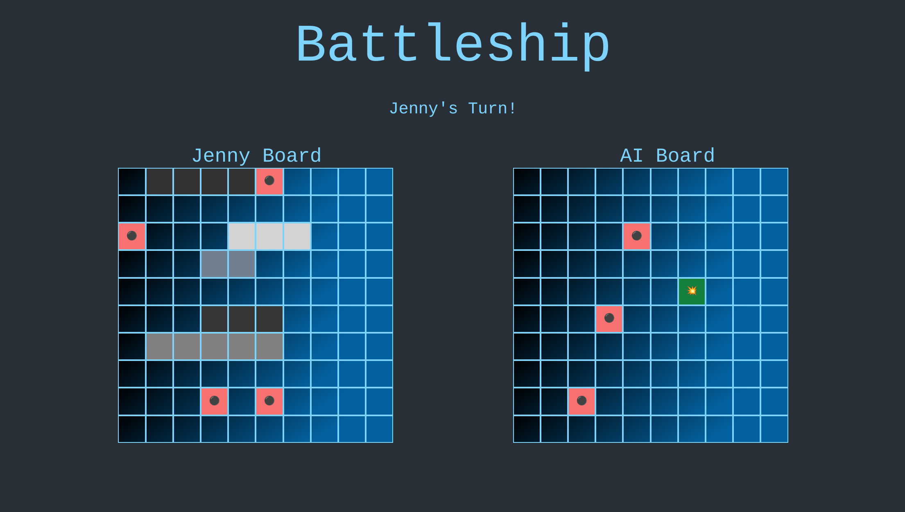

# Battleship

> Live game demo [_here_](https://nabelk.github.io/battleship/).

## Table of Contents

-   [General Info](#general-information)
-   [Built With](#built-with)
-   [Screenshots](#screenshots)
-   [Contact](#contact)

## General Information

-   The project is a part of The Odin Project: Full Stack JavaScript.
-   BattleShip is a classic strategy board game that simulates naval warfare. It's played on a grid, where players hide their ships and take turns guessing their opponent's ship locations.

## Built With

-   Javascript
-   SCSS
-   Tailwind
-   HTML
-   Webpack
-   Flowbite
-   Prettier && eslint
-   Concurrently
-   Babel
-   Jest

## Screenshots

## Contact

Created by [@nabelk](https://www.linkedin.com/in/nabil-khalid-36791a241/) - feel free to contact me!
